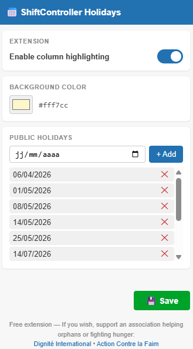
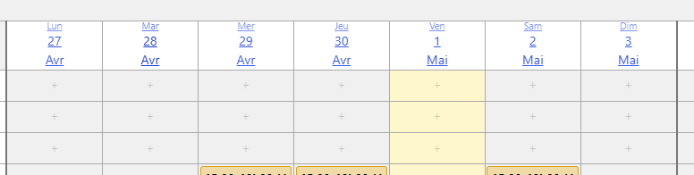

# ShiftController Holidays - Chrome Extension

Highlights columns corresponding to public holidays in ShiftController4 WordPress plugin pages.

Compatible with ShiftController Employee Shift Scheduling Plugin, version 4.9.81.

## Features

- Add and remove public holiday dates manually.
- Choose a custom background color for holiday columns.
- Enable or disable the extension at any time.
- Works on pages using `/wp-admin/admin.php?page=shiftcontroller4`.

## Screenshots

### Holiday date entry and color selection interface

### Shift table

## Installation (Developer Mode)

1. Unzip this archive to a local folder.
2. Open Chrome and go to `chrome://extensions/`.
3. Enable **Developer Mode** in the top right corner.
4. Click **Load unpacked** and select the unzipped folder.

## How to Use

1. Click the extension icon in the Chrome toolbar.
2. Add public holiday dates using the date picker.
3. Choose a background color.
4. Click **Save** - columns will be highlighted immediately.

## Privacy

No data is collected or transmitted. All settings are stored locally.
See `privacy_policy.txt` for details.

## Free Extension

This extension is free. If you wish, support a charity:

- Dignite International: https://www.dignite-international.org/
- Action Contre la Faim: https://www.actioncontrelafaim.org

## License

MIT License.
